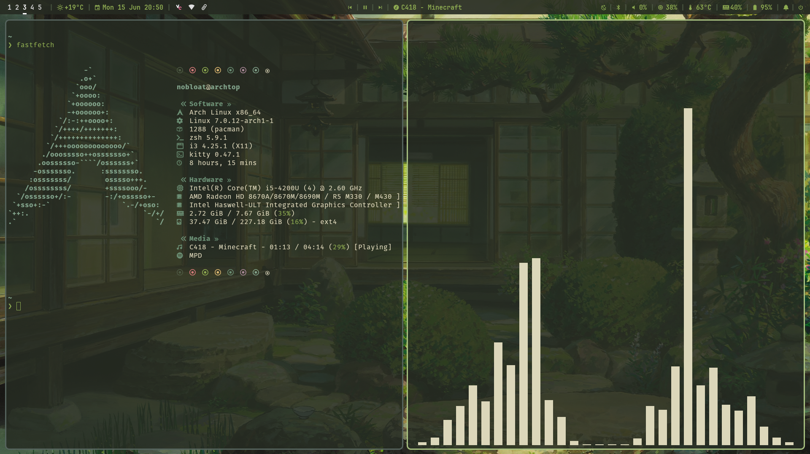
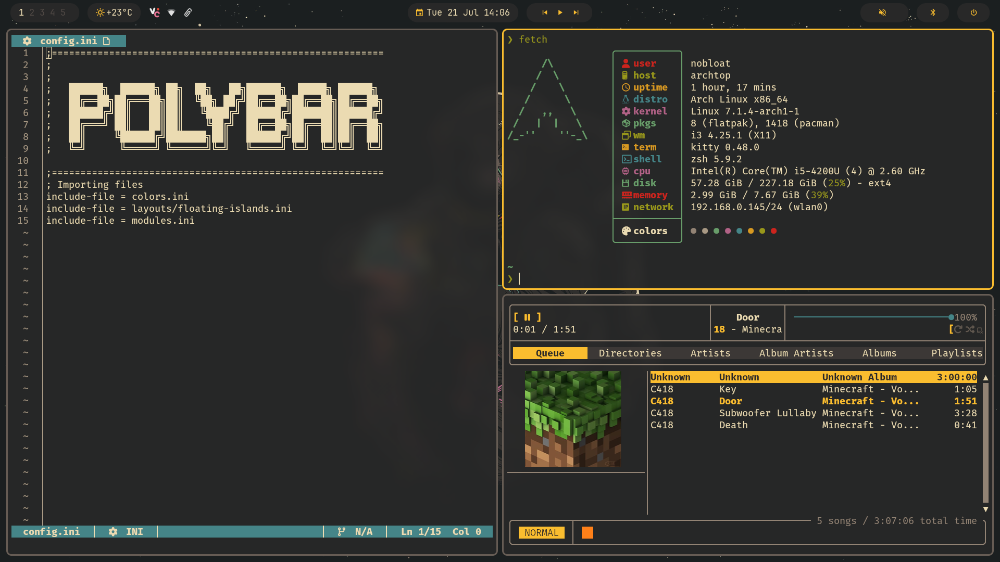
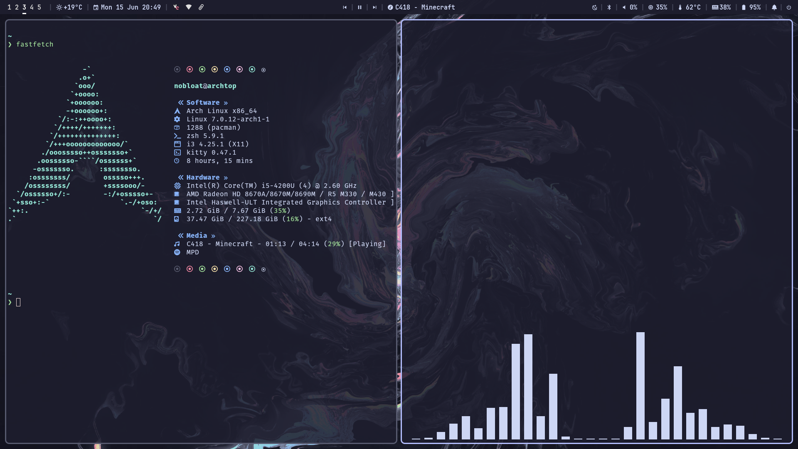

#dotfiles

My personal dotfiles and custom ricing environment for Arch Linux, featuring a hybrid X11 (i3) and Wayland (Hyprland) workspace setup.

## 🎬 Showcase

https://github.com/user-attachments/assets/8ce555a0-0ac7-45eb-b75c-b3f582bb57f7

## 📸 Screenshots

| Monochrome | Everforest | Gruvbox | Catppuccin Mocha |
|--- |--- |--- |--- |
|  |  |  |  |

<br>

👉 [**For More Screenshots, Go To The Assets Folder**](./assets)

## 🛠️ Setup Core

* **WM / Compositors:** i3 & Hyprland
* **Terminals & Shell:** Kitty & Starship Prompt
* **Status Bars & Panels:** Polybar & Wayle (SCSS Engine)
* **Launchers & Menus:** Rofi / Rofi Core
* **Notifications:** Dunst
* **Audio & Visuals:** MPD, rmpc (TUI client), MPV, & Cava Visualizer
* **Compositing & Effects:** Picom (X11)
* **System Info:** Fastfetch

## ✨ Environment Features

* **🎨 Theme Palette Synchronization:** Global theme assets divided into Monochrome, Everforest, Gruvbox, and Catppuccin Mocha colorscapes across apps (including Cava, Fastfetch, and GTK environments).
* **🖼️ Wallpaper Switcher:** Handled via feh, pulling from specialized subdirectories matching your active system palette.
* **💎 Custom Player UI:** Enhanced MPV playback interface utilizing the custom asset-driven ModernZ UI layout wrapper.

## 📜 Custom Automation Scripts

This configuration houses an array of utility scripts mapped to quick environment keys:

### 🌐 System Launcher (Rofi Engine)
* `wallpaper-picker.sh` — Interactive graphical background selector.
* `power-menu.sh` — Session shutdown, reboot, and suspension grid selector.
* `rofi-bluetooth.sh` — Quick device pairing and controller manager.
* `rofi-record.sh` — Live screen recording toggle engine.
* `rofi-web-search.sh` — Native desktop terminal browser lookups.
* `scratchpad.sh` & `theme-switcher.sh` — Window stacking utilities and canvas controls.

### 📊 Status Modules & Bars
* `player-mpris.py` — Dynamic media metadata fetcher tracking system audio states on the bar.
* `weather-tui.sh` / `weather.sh` — Local climate tracking feeds feeding both Polybar and Hyprland modules.
* `polybar-scratchpad.sh` & `workspaces.sh` — Layout and workspace context calculation loops.

### ⚙️ Hardware & System Hooks
* `brightness-up.sh` / `brightness-down.sh` — Direct backlight controller integration for i3 keybinds.
* `media.sh` — Audio backend management framework under Wayland.

## 🚀 Installation & Deployment

This configuration includes a deployment script to easily bootstrap dependencies (including AUR packages) and clone configurations onto any fresh Arch Linux system. All standard and AUR packages are enabled by default in `packages.txt`.

### 1. Deployment (From Repo to PC)
To pull your snapshot out of the repository and overwrite your active system configurations with these files, run the installer:
```bash
git clone [https://github.com/NotAI-fr/dotfiles.git](https://github.com/NotAI-fr/dotfiles.git)
cd dotfiles
chmod +x install.sh
./install.sh
```
*(Don't worry—if you have existing configurations, the script automatically bundles them into a dated backup folder inside your home directory before laying down the repository snapshot).*

### 2. Snapshot Backups (From PC to GitHub)
Whenever you make changes locally on your system and want to save a pristine snapshot out to this repository, execute your sync tools:
```bash
./backup.sh
# or 
./sync.sh
```

## 🖼️ Wallpapers

Wallpaper categories for each colorscheme:

*  [**Monochrome**](./Walls/monochrome)
*  [**Catppuccin**](./Walls/catppuccin)
*  [**Gruvbox**](./Walls/gruvbox)
*  [**Everforest**](./Walls/everforest)

## 📂 File Structure

```text
dotfiles/
├── colorschemes/    # Theme configurations for Cava, Dunst, Fetch, GTK, i3, Kitty, Polybar, rmpc, & Rofi
├── dunst/           # Notification daemon custom rule matrices and system styles
├── fastfetch/       # System asset blueprint data layout configurations
├── hypr/            # Highly modularized Lua-based Hyprland compositor modules and environment rules
├── i3/              # i3 window manager setups with direct brightness scripts
├── kitty/           # Terminal profiles and primary configuration frameworks
├── mpd/             # Local music database configurations, rulesets, and local socket endpoints
├── mpv/             # Custom video playback rules running the ModernZ UI engine layout
├── picom/           # X11 rendering and window composite configurations (shadows/blur effects)
├── polybar/         # Multi-monitor status bar engines including script bindings and workspaces handlers
├── rmpc/            # Modern terminal music client configuration sheets (.ron profiles)
├── Rofi/            # Main launcher directory loaded with custom system scripts
├── rofi/            # Alternate fallback launcher layout variants
├── Walls/           # System background storage organized into specific color spaces
│   ├── catppuccin/
│   ├── everforest/
│   ├── gruvbox/
│   └── monochrome/
├── wayle/           # Wayland SCSS-rendered status bar styling layers
├── wlogout/         # Wayland graphical logout grid panel configurations and custom SVG vector icons
├── config.ini       # Main environment override settings
├── starship.toml    # Shell context interface and prompt configuration layout
├── packages.txt     # Complete system dependency registry file (Core and AUR packages)
├── backup.sh        # Core automated file capture script
├── sync.sh          # Secondary configuration synchronization helper
└── install.sh       # Automated package sync and configuration copy script
```
