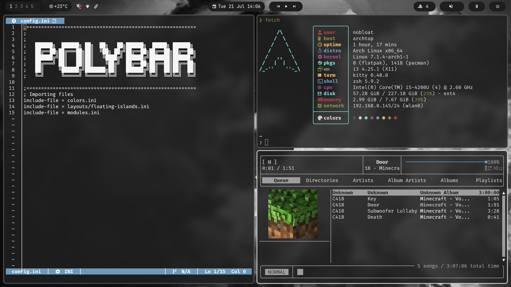
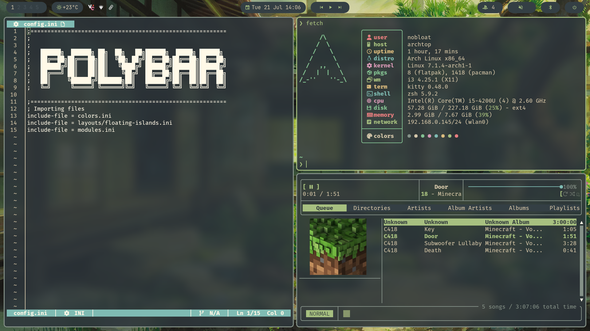
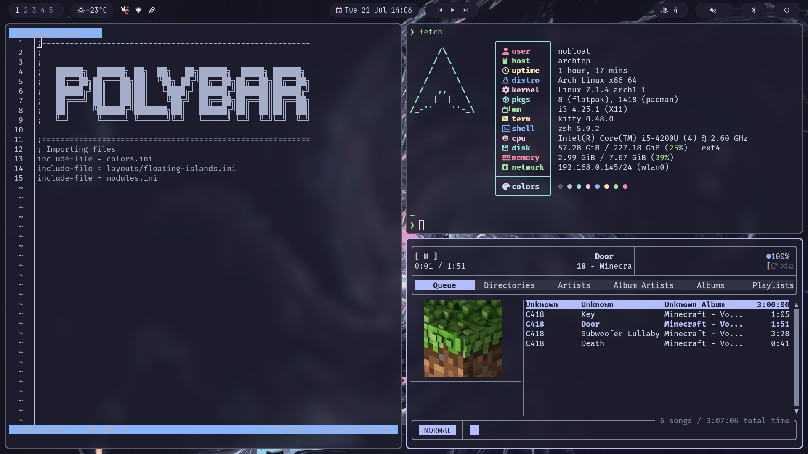
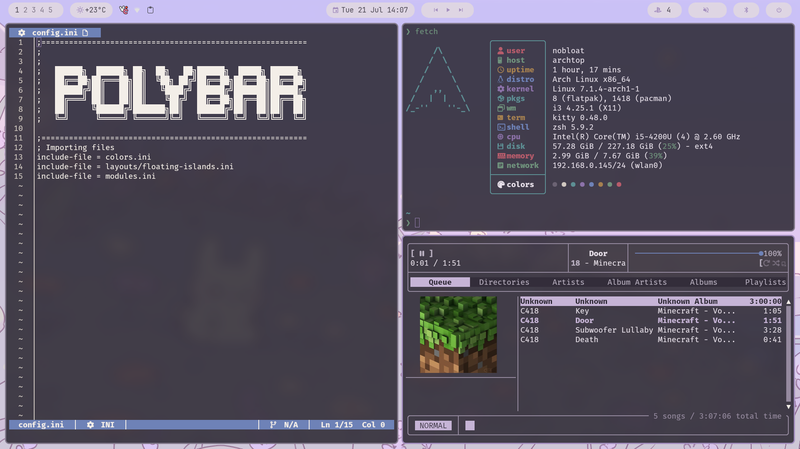
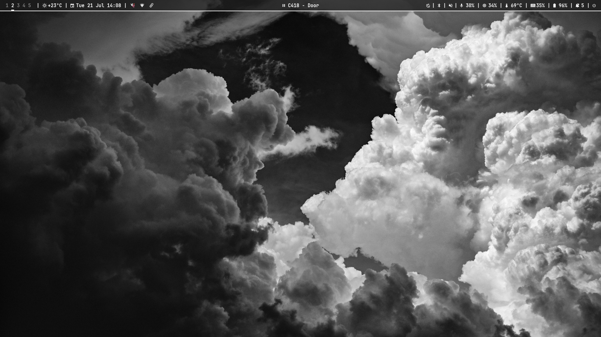
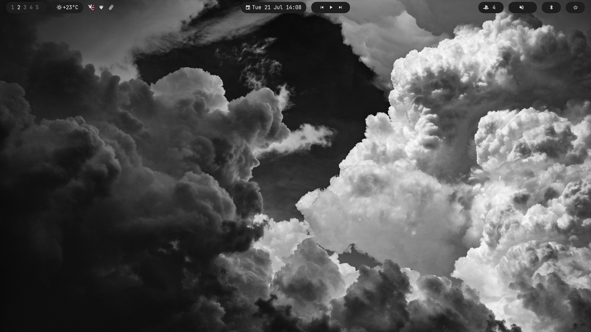
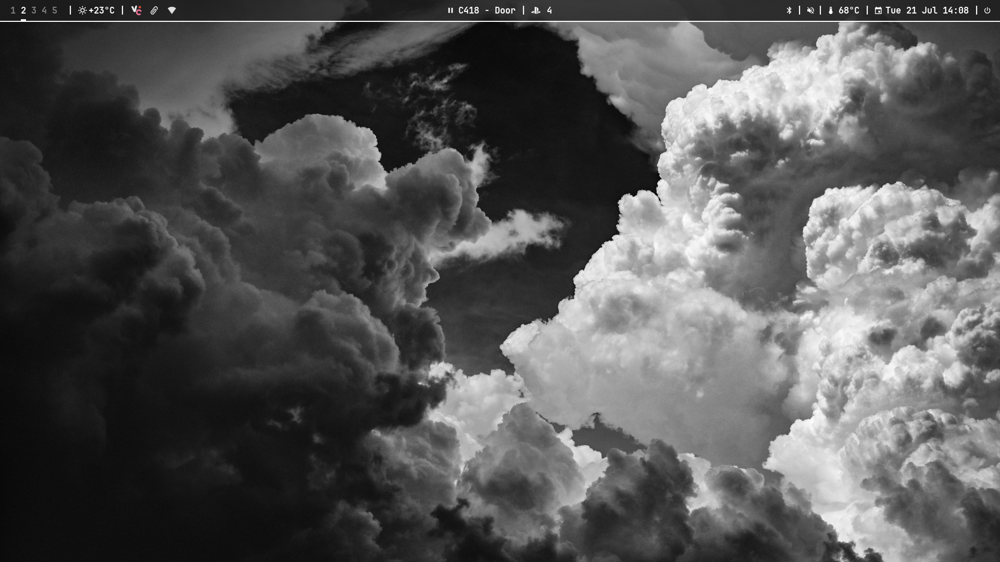

# i3 Dotfiles

<p align="center">
  

https://github.com/user-attachments/assets/54d04845-bf80-4628-b76a-9946fef436a8


</p>

<p align="center">
  A polished Arch Linux <strong>i3/X11</strong> desktop built around synchronized themes, switchable Polybar layouts, and Rofi-powered utilities.
</p>

<p align="center">
  
  
  
  
  
</p>

> The Wayland and Hyprland files in this repository are kept only as personal backups. This README and showcase focus entirely on the active i3 setup.

## Themes

One Rofi menu switches the wallpaper and colours across i3, Polybar, Rofi, Kitty, rmpc, Cava, Dunst, and GTK.

| Monochrome | Everforest | Gruvbox |
|---|---|---|
|  |  |  |

| Catppuccin Mocha | Lavender Light |
|---|---|
|  |  |

### Theme switching includes

- i3 borders and focused-window colours
- Polybar colours
- Rofi colours
- Kitty colours
- rmpc and Cava colours
- Dunst notification colours
- GTK theme and icon theme
- Desktop wallpaper
- Betterlockscreen wallpaper cache

## Polybar layouts

Three layouts can be switched instantly through Rofi.

| Default | Floating Islands | Minimal |
|---|---|---|
|  |  |  |

- **Default** — the full setup with system information, tray, media, notifications, notes, and hardware controls.
- **Floating Islands** — rounded modules floating on a transparent bar canvas.
- **Minimal** — a compact everyday layout with only the essentials.

## Desktop stack

| Role | Program |
|---|---|
| Window manager | i3 |
| Status bar | Polybar |
| Launcher and menus | Rofi |
| Terminal | Kitty |
| Shell | Zsh + Starship |
| Compositor | Picom |
| Notifications | Dunst |
| File manager | Nemo |
| Lock screen | Betterlockscreen |
| Music | MPD + rmpc |
| Video | MPV + ModernZ |
| Terminal editor | Ox |
| System information | Fastfetch |

## Features

### Rofi desktop toolkit

Custom Rofi menus provide:

- Application launching
- Theme switching
- Polybar layout switching
- Wallpaper browsing
- Power and game-mode controls
- Bluetooth management
- Screen recording
- Scratchpad notes
- Config-file editing in Ox
- Calculator
- Web search

### Wallpaper picker

The wallpaper picker includes:

- Theme-based categories
- Thumbnail previews
- Favourites
- Random selection
- Current-wallpaper tracking
- Thumbnail cache rebuilding
- Betterlockscreen cache updates
- Theme-matched menu colours

### Config menu

The config menu groups important files into clean sections:

- i3
- Polybar
- Rofi
- rmpc
- Colourschemes
- Kitty

Files and folders open in **Ox inside Kitty**.

### Scratchpad notes

The Rofi scratchpad can:

- Capture quick notes
- Sort entries into todos, ideas, brain dumps, and general notes
- Search previous entries
- Copy entries
- Delete individual entries
- Clear a whole category
- Show note counts in Polybar

### Screen recorder

The recorder supports:

- Fullscreen recording
- Region recording
- No audio
- Microphone audio
- Desktop audio
- Mixed microphone and desktop audio
- Toggle-to-stop behaviour

### Polybar modules

Depending on the selected layout, Polybar can show:

- i3 workspaces
- Weather
- Date and time
- System tray
- MPRIS media information and controls
- Audio output and microphone state
- CPU, memory, temperature, and battery
- Bluetooth state
- Dunst notification state
- Scratchpad note counts
- Night-light controls
- Power menu
- Optional PlayStation friend presence

The PlayStation module can display an online-friend count and open Rofi lists for online or all friends.

### i3 workflow

- Five workspaces
- Gaps and themed borders
- Autotiling
- Fullscreen and floating controls
- Native i3 scratchpad support
- Media-key controls
- External-monitor brightness controls with Dunst OSD
- Floating rules for selected utilities
- Modular keybind and startup files

### Terminal and shell

Kitty includes:

- Nerd Font support
- Background transparency
- Minimal decorations
- Theme includes
- Familiar clipboard paste binding

Zsh includes:

- Shared and deduplicated history
- Case-insensitive completion
- fzf-tab
- Autosuggestions
- Syntax highlighting
- Starship prompt
- Zoxide

### Music and video

- MPD music daemon
- rmpc with mouse support, album art, lyrics, playlists, search, and queue views
- MPV with the ModernZ interface
- Polybar MPRIS playback controls

## Useful shortcuts

| Shortcut | Action |
|---|---|
| `Super + Space` | Application launcher |
| `Super + T` | Theme and Polybar-layout switcher |
| `Super + W` | Wallpaper picker |
| `Super + P` | Power and game-mode menu |
| `Super + B` | Bluetooth menu |
| `Super + N` | Scratchpad notes |
| `Super + Shift + P` | Screen recorder |
| `Super + Shift + C` | Config menu |
| `Super + X` | Calculator |
| `Super + S` | Region screenshot |
| `Super + Q` | Kitty |
| `Super + E` | Nemo |
| `Super + L` | Lock screen |
| `Super + C` | Close focused window |
| `Super + F` | Fullscreen |
| `Super + Shift + F` | Toggle floating |
| `Super + 1–5` | Change workspace |
| `Super + Shift + 1–5` | Move window to workspace |
| `Super + Shift + R` | Reload i3 and restart Polybar |

## Repository structure

```text
dotfiles/
├── i3/                 # i3 config, keybinds, startup, and scripts
├── polybar/            # Shared modules, layouts, and helper scripts
├── rofi/               # Launcher themes and custom desktop menus
├── colorschemes/       # Synchronized colour profiles
├── Walls/              # Wallpapers grouped by theme
├── kitty/              # Terminal configuration
├── dunst/              # Notification styling
├── picom/              # Blur, transparency, and rounded corners
├── rmpc/               # MPD client configuration
├── mpd/                # MPD configuration
├── mpv/                # MPV and ModernZ configuration
├── ox/                 # Ox plugins
├── .oxrc               # Ox editor configuration
├── fastfetch/          # System-information layout
├── assets/             # README screenshots
├── .zshrc              # Shell configuration
└── starship.toml       # Prompt configuration
```

Other window-manager and Wayland folders may remain in the repository as personal backups, but they are not part of the documented i3 setup.

## Notes

This is a personal configuration rather than a universal installer. Monitor names, resolution, weather location, preferred applications, and personal paths may need to be changed before reuse.
